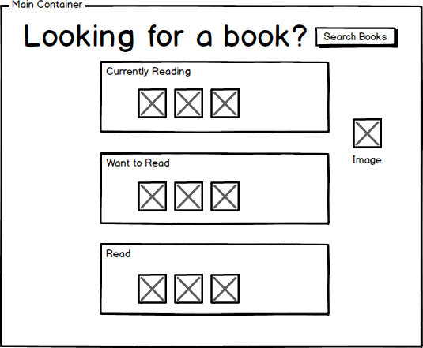

Project shows a list of "Currently Reading", "Wanted to Read", and "Read" books that have been or can be added by a search that pulls information from the Udacity book server (https://reactnd-books-api.udacity.com).

Install using npm install and load via yarn start or npm start.

The general concept of the app is shown in the following figures.

