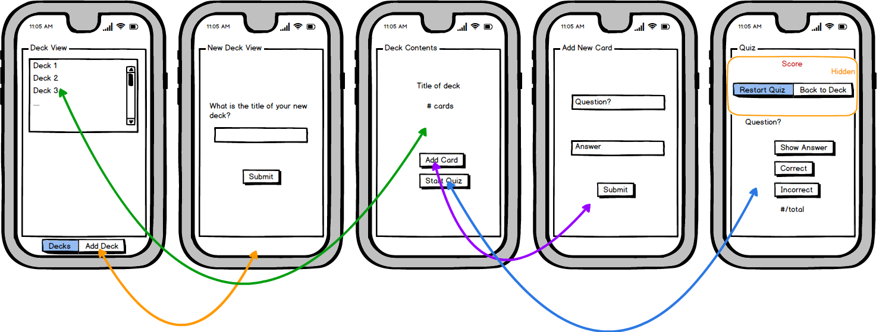

## Udacicards Project

This project was bootstrapped with [Create React Native App](https://github.com/react-community/create-react-native-app).

Several key node modules were installed. Namely, [expo](https://expo.io), for emulation, notifications, etc., [react-native-elements](https://react-native-training.github.io/react-native-elements/), for UI, and [redux](https://redux.js.org), for state handling along with [react-redux](https://github.com/reduxjs/react-redux), [tcomb-form-native](https://github.com/gcanti/tcomb-form-native) for forms, and [lodash](https://lodash.com) for object manipulation, iteration, etc.

Project was tested on IOS and IOS emulator.

The general concept of the App is shown in the following figure.



## Installation and Running
Within the `udacicards` directory run the following commands:
* `npm install` will install all node modules required for the project.
* `npm start` or `yarn start` will begin the Readable App.

To use expo, please install xcode and command line tools. Homebrew on OSX may be used to install watchman `brew install watchman` for memory allocation control.

## Folder Structure

After creation, your project should look like this:

```
Udacicards/
  actions/
    index.js
  components/
    AddCard.js
    AddDeck.js
    Decks.js
    DeckView.js
    QuizView.js
  reducers/
    index.js
  utils
    colors.js
    helpers.js
  package.json
  App.js
concept.png
udacicards_project.bmpr
README.md
```

## Sending Feedback

I am always open to [your feedback](http://jessequinn.info).
